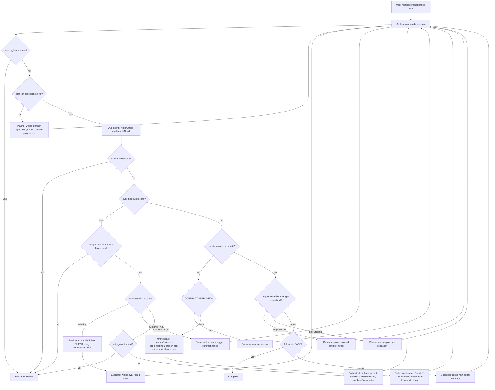

[中文](./README.zh-CN.md) | **English**

# SprintFoundry

SprintFoundry is a multi-agent harness for product iteration: Claude handles planning, routing, and independent evaluation, while Codex handles real code implementation. This repository is primarily a process and protocol repo. It is not an application codebase by itself.

## Project Architecture

### Core Roles

The harness is built around four collaborating roles:

| Role | Runtime | Responsibility |
| --- | --- | --- |
| Planner | Claude Code | Expands a short user request into a product spec, visual design language, and sprint plan |
| Generator | Codex CLI | Reads the spec and approved sprint contract, implements one sprint, self-checks, and commits |
| Evaluator | Claude Code + verification tools | Reviews the sprint contract and performs an independent black-box CHECK: browser, API, CLI, job, or library |
| Orchestrator | Claude Code | Reads file state and decides whether to invoke the Planner, Generator, or Evaluator |

### Boundary of Responsibility

This architecture has a strict boundary:

- Claude does not write application code
- Codex does not evaluate its own output
- Progress advances through file artifacts, not chat memory

### File-State Architecture

The harness is designed as a file-driven state machine rather than a conversational memory system:

- `planner-spec.json`
  Product spec, design language, tech stack, verification mode, and sprint list written by the Planner
- `change-request.md`
  Post-launch iteration request that must be classified before entering an iteration sprint or replan path
- `bug-report.md`
  Dedicated defect intake used to create a standalone bugfix sprint
- `sprint-contract.md`
  The acceptance contract for the current sprint; must be approved by the Evaluator first
- `sprint-fence.json`
  Per-sprint boundary record (expected sprint number + git HEAD at contract approval) written by the Orchestrator before invoking Codex. Guards against multi-sprint drift: if `eval-trigger.txt` references a sprint that disagrees with the fence, the Orchestrator pauses.
- `eval-result-{N}.md`
  Sprint evaluation result for sprint `N`; only the Evaluator can write it
- `eval-trigger.txt`
  Signal file written after the Generator commits
- `run-state.json`
  Unattended-mode run state, retry counters, and escalation flags
- `run-events.ndjson`
  Structured runtime event stream for auditing and monitoring
- `orchestrator-log.ndjson`
  Audit log for Orchestrator routing decisions
- `human-escalation.md`
  Human-facing handoff summary when the loop pauses
- `claude-progress.txt`
  Compact cross-session progress log
- `harness-audit.ndjson`
  Append-only forensic timeline. Records every orchestrator run, audit finding, state transition, commit, and hook block/bypass. Never rewritten.
- `init.sh`
  Unified entrypoint for starting the full development environment

## Required Entry Point

If you want the workflow to be enforced instead of loosely followed through prompting, treat this as the only valid entrypoint:

```bash
./orchestrate.sh --project-dir /absolute/path/to/project --user-prompt "one-line product request"
```

Or run the Python entry directly:

```bash
python3 scripts/orchestrate.py --project-dir /absolute/path/to/project --user-prompt "one-line product request"
```

It reads disk state first, then routes to the next phase:

- No `planner-spec.json` -> Planner only
- `bug-report.md` exists -> bugfix sprint contract first
- `change-request.md` with `Type: minor_feature` -> iteration sprint contract first
- `change-request.md` with `Type: major_feature` or `replan` -> Planner revises the spec first
- `sprint-contract.md` exists but has no `CONTRACT APPROVED` -> Evaluator contract review only
- `eval-trigger.txt` exists -> Evaluator CHECK only
- Generator implementation is only allowed after the contract is approved

The point is to prevent the main agent from jumping straight into implementation.

### Context Hygiene Design

This harness is designed for long-running work without context bloat. The goal is not to make the model remember everything; the goal is to make each phase rely on the smallest current set of valid facts.

Design principles:

- Store state in files instead of long chat memory
- Keep each sprint as a rereadable, isolated work unit
- Separate Generator and Evaluator so the system cannot self-certify
- Use `claude-progress.txt` as a compressed handoff, not an ever-growing transcript

As the project gets longer, the system should depend on reconstructible context rather than accumulated context.

### Sprint Branching

The recommended setup is one Git branch per sprint instead of stacking all implementation directly onto `main`.

Benefits:

- Each sprint's implementation and retry history stay isolated
- Evaluator failures are easier to inspect and repair
- `main` only contains accepted progress
- Unattended mode can record and recover the active branch explicitly

### Monotonic-PASS Invariant & Audit Log

Sprint N is considered complete only when `eval-result-{N}.md` exists and contains the literal string `SPRINT PASS`. Every other file (`run-state.json`, `claude-progress.txt`, the sprint branch, commit log) is derived state and must not be trusted for completion decisions.

Two layers enforce this invariant:

1. **Detective — Orchestrator audit.** `scripts/orchestrate.py` runs `audit_sprint_history` before every routing rule. If declared state disagrees with the `eval-result-{N}.md` files — for example Sprint N is marked advanced while a prior sprint lacks `SPRINT PASS` — the Orchestrator pauses with `needs_human=true` before any other rule can fire.
2. **Preventive — Git hooks.** `.githooks/pre-commit` refuses commits that advance the sprint counter while any earlier sprint lacks `SPRINT PASS`. `.githooks/post-commit` records every commit (sha, author, subject, touched sensitive paths) into `harness-audit.ndjson`. Install them once per clone:

   ```bash
   bash scripts/install-hooks.sh
   ```

   Only `HARNESS_BYPASS=1 git commit ...` can bypass the pre-commit hook, and every bypass is itself recorded as a `commit_bypassed` event so no emergency override is invisible.

`harness-audit.ndjson` is a single append-only NDJSON file written by the Orchestrator, the git hooks, and humans (via `scripts/harness-log.py note`). Event types include `orchestrator_run`, `audit_finding`, `state_transition`, `eval_result_observed`, `commit_recorded`, `commit_blocked`, `commit_bypassed`, and `note`. Never rewrite this file — to rotate, copy it aside and let a new one be created on the next append.

Useful audit commands:

```bash
python3 scripts/harness-log.py tail -n 30
python3 scripts/harness-log.py filter --event audit_finding
python3 scripts/harness-log.py filter --sprint 3 --json
python3 scripts/harness-log.py verify                # reconcile state vs eval-results
python3 scripts/harness-log.py note --text "reason"  # annotate a manual action
```

### Documentation Layers

The repository is organized into hot-path prompts and cold reference docs:

1. [AGENTS.md](./AGENTS.md)
   Compact Codex operating contract. This is read directly by Codex and should stay small.
2. [CLAUDE.md](./CLAUDE.md)
   Compact Claude Code routing guide.
3. [.claude/agents/planner.md](./.claude/agents/planner.md)
   [.claude/agents/generator.md](./.claude/agents/generator.md)
   [.claude/agents/evaluator.md](./.claude/agents/evaluator.md)
   [.claude/agents/orchestrator.md](./.claude/agents/orchestrator.md)
   Role-specific prompts loaded by Claude Code.
4. [docs/protocol.md](./docs/protocol.md)
   Full historical protocol reference. Read on demand; do not treat it as a hot-path prompt.

### Current Repository Status

- This is a process/protocol repository, not an application code repository.
- The main workflow today is a sprint loop centered on `planner-spec.json`.
- The harness currently supports three entry modes: new product planning, bugfix sprints, and iteration sprints.
- `AGENTS.md`, `CLAUDE.md`, and `.claude/agents/*.md` are intentionally compact.
- `docs/protocol.md` preserves the longer protocol and historical rationale for on-demand reference.

## Workflow

The full flow looks like this:



Key gates:

- Without `CONTRACT APPROVED`, the Generator must not start coding.
- Without `sprint-fence.json` matching `eval-trigger.txt`, the Orchestrator refuses to route to the Evaluator and pauses.

Key state rules:

- No `planner-spec.json` means planning comes first
- `bug-report.md` means bugfix routing comes first
- `change-request.md` is routed by `Type` into bugfix, iteration, or replan
- Unapproved `sprint-contract.md` means contract review comes first
- `eval-trigger.txt` means independent CHECK comes first
- A sprint is complete only when `eval-result-{N}.md` contains `SPRINT PASS`
- After a SPRINT PASS the Orchestrator removes `sprint-contract.md` and `sprint-fence.json` so the next sprint must renegotiate its contract

## Verification Modes

The Evaluator is a black-box verifier, not a browser-only verifier. The Planner should include a `verification` block in `planner-spec.json` so the sprint contract can be tested through the right surface:

```json
{
  "verification": {
    "mode": "browser | api | cli | job | library",
    "base_url": "http://localhost:3000",
    "command": "pytest -q"
  }
}
```

Supported modes:

| Mode | Evaluator surface | Typical evidence |
| --- | --- | --- |
| `browser` | Playwright MCP | Screenshots, visible UI state, user flows |
| `api` | `curl`, `httpx`, OpenAPI/Newman-style checks | HTTP status, JSON bodies, persisted API-visible state |
| `cli` | Shell commands | Exit code, stdout/stderr, generated files |
| `job` | Queue/job endpoints or scripts | Enqueued task, polling status, side effects |
| `library` | External consumer project or sample script | Import/install success and public API output |

Sprint contracts should use **black-box-verifiable** success criteria. A backend API criterion is just as valid as a browser criterion:

```markdown
- [ ] Client can create a user and fetch it by id.
  Evaluator steps:
  1. Run `bash init.sh`
  2. POST `http://localhost:8000/users` with JSON `{ "email": "a@example.com" }`
  3. Assert status is 201 and the response body contains an `id`
  4. GET `http://localhost:8000/users/<id>`
  5. Assert status is 200 and `email` equals `a@example.com`
```

## Context Hygiene Rules

To reduce AI slop, patch-on-patch drift, and context inflation, the harness assumes these rules by default:

### 1. Files Override Chat

- Every phase begins by reading the current file artifacts
- If files and chat disagree, trust the files
- The Orchestrator routes from disk state, not remembered conversation state

### 2. `claude-progress.txt` Stays Compact

`claude-progress.txt` is a rolling handoff, not a transcript:

- Keep the latest project summary
- Keep only the most recent three sprint entries
- Keep each sprint entry to three to five lines
- Record only status, major changes, blockers, and evaluator feedback

Older content should be compressed, not endlessly appended.

### 3. Read Only the Minimum Required Context

Before implementation, the Generator should reread only:

- `planner-spec.json`
- `sprint-contract.md`
- The latest relevant `eval-result-{N}.md` only when retrying

The full chat history must not be treated as implementation truth.

### 4. Run a Hygiene Pass Before Every Commit

Before each sprint commit, check:

- No debug output or temporary logs remain
- No duplicated logic was created during retries
- No low-quality wrapper abstractions were added just to avoid cleanup
- The diff is still focused on the approved sprint rather than opportunistic scope creep

### 5. Sprint Failure Fixes Must Stay Narrow

When a sprint fails:

- Fix only what the Evaluator cited
- Do not mix in unrelated refactors
- If the issue has become architecture drift, route it back to planning instead of piling on patches

## Unattended Mode

If you want the harness to advance automatically over time, use a bounded unattended loop rather than an infinite autonomous cycle.

### Design Goals

- Recover from file state on every run
- Support timer-based or daemon-based execution
- Pause automatically on repeated failure
- Leave a clear handoff point for a human

### Key State File

Unattended mode should maintain `run-state.json`. A template is included:

- [run-state.example.json](./run-state.example.json)

Recommended fields:

- `mode`
- `current_sprint`
- `retry_count`
- `last_successful_sprint`
- `last_failure_reason`
- `needs_human`
- `active_branch`
- `base_branch`
- `last_run_at`

### Suggested Execution Loop

```text
Timer / daemon
  -> Read run-state.json
  -> Run Orchestrator
  -> Invoke Planner / Codex / Evaluator according to file state
  -> Update run-state.json and claude-progress.txt
  -> Decide complete / paused / next loop
```

### Required Pause Conditions

To avoid infinite self-looping, pause and wait for a human when:

- The same sprint fails more than twice
- `init.sh` cannot recover the development environment
- The Evaluator classifies the issue as architecture drift
- The sprint contract would need to change in order to continue
- Required secrets, services, or dependencies are missing

At minimum, a pause should:

- Write `mode = paused` and `needs_human = true` into `run-state.json`
- Add a short blocker summary to `claude-progress.txt`

## Repository Layout

```text
.
├── AGENTS.md
├── CLAUDE.md
├── README.md
├── README.zh-CN.md
├── orchestrate.sh
├── scripts/
│   ├── orchestrate.py
│   ├── harness-log.py
│   └── install-hooks.sh
├── .githooks/
│   ├── pre-commit
│   └── post-commit
├── tests/
│   └── test_orchestrate.py
├── .claude/
│   ├── agents/
│   │   ├── evaluator.md
│   │   ├── generator.md
│   │   ├── orchestrator.md
│   │   └── planner.md
│   └── skills/
│       ├── harness-branching/
│       │   └── SKILL.md
│       └── harness-observability/
│           ├── SKILL.md
│           └── references/
├── harness-audit.ndjson
├── run-state.example.json
├── run-events.example.ndjson
├── orchestrator-log.example.ndjson
├── human-escalation.example.md
├── change-request.example.md
└── bug-report.example.md
```

Role prompts and skills live under `.claude/` so Claude Code picks them up
automatically as subagent definitions and local skills.

## Local Skills

The repository currently includes two local operational governance skills:

- [.claude/skills/harness-observability/SKILL.md](./.claude/skills/harness-observability/SKILL.md)
- [.claude/skills/harness-branching/SKILL.md](./.claude/skills/harness-branching/SKILL.md)

They package the following capabilities into reusable workflows:

- unattended run-state maintenance
- structured event logging
- Orchestrator routing audit logs
- human escalation summaries
- `claude-progress.txt` compression and context hygiene
- sprint branch creation, switching, and merge constraints

The repository also includes minimal templates:

- [run-state.example.json](./run-state.example.json)
- [run-events.example.ndjson](./run-events.example.ndjson)
- [orchestrator-log.example.ndjson](./orchestrator-log.example.ndjson)
- [human-escalation.example.md](./human-escalation.example.md)

## Usage

### 1. Prepare the Environment

Minimum requirements:

- Claude Code
- Codex CLI
- Node.js / npm
- Python and `pytest`
- Playwright MCP
- A real project directory that can actually start

`CLAUDE.md` shows the minimum Codex setup:

```bash
npm install -g @openai/codex
codex --version
```

If Codex is already authenticated locally, you do not need `OPENAI_API_KEY`.
You only need it in a pure CLI environment where Codex has not been logged in yet.

If you need Playwright MCP, configure it as shown in `CLAUDE.md`:

```json
{
  "mcpServers": {
    "playwright": {
      "command": "npx",
      "args": ["@playwright/mcp@0.0.29"]
    }
  }
}
```

Pinning the Playwright MCP version is recommended instead of using `@latest`, so long-running projects do not break on upstream changes.

### 2. Initialize a Real Project

This repository does not include `planner-spec.json`, `init.sh`, tests, or application code by default. To use the harness with a real project, you would typically:

1. Copy the protocol files into the target project directory.
2. Initialize a Git repository.
3. Let the Planner generate:
   - `planner-spec.json`
   - `init.sh`
   - `claude-progress.txt`
4. Make sure `init.sh` can actually start the frontend, backend, and dependencies.

In practical terms:

- This repository provides the collaboration protocol
- The actual application code, tests, database, and runtime scripts belong in the product repo that adopts it

### 3. Orchestrator Phase

The Orchestrator is the entrypoint. It reads file state first, then decides which path to take:

- no `planner-spec.json` -> call Planner
- `bug-report.md` exists -> call Codex to create a bugfix sprint contract first
- `change-request.md` exists -> route by `Type` into bugfix, minor iteration, or replan
- pending `sprint-contract.md` exists -> call Evaluator for contract review
- `eval-trigger.txt` exists -> call Evaluator for CHECK
- otherwise -> call Codex for the next sprint

If `claude-progress.txt` has turned into a long log, the Orchestrator should compress it back into summary form before continuing.
If unattended mode is enabled, the Orchestrator should also read and write `run-state.json` and pause proactively after exceeding retry thresholds.

The repository includes a minimal executable implementation:

- [scripts/orchestrate.py](./scripts/orchestrate.py)
- [orchestrate.sh](./orchestrate.sh)
- [change-request.example.md](./change-request.example.md)
- [bug-report.example.md](./bug-report.example.md)
- [tests/test_orchestrate.py](./tests/test_orchestrate.py)

It currently:

- reads `planner-spec.json` / `change-request.md` / `bug-report.md` / `sprint-contract.md` / `eval-trigger.txt`
- computes the current sprint
- updates `run-state.json`
- appends to `orchestrator-log.ndjson` and `run-events.ndjson`
- blocks direct implementation when contract approval is missing
- creates the appropriate contract first for bugfix and iteration requests instead of jumping straight to code

### 4. Planner Phase

When the user provides a one- to four-sentence product request, the Planner in Claude generates the complete specification.

Outputs:

- `planner-spec.json`
- `init.sh`
- initial `claude-progress.txt` entry

### 5. Generator Phase

The Orchestrator invokes the Generator through Codex CLI. The Generator is not a Claude subagent; it is an external Codex process.

`scripts/orchestrate.py` now performs Codex version-aware command selection:
- `>= 0.120.0` uses `codex exec --full-auto --skip-git-repo-check`
- older versions fall back to `codex -a never exec --skip-git-repo-check`

Typical invocation:

```bash
codex exec --full-auto --skip-git-repo-check \
  "Read planner-spec.json. Propose sprint-contract.md for Sprint N. Follow AGENTS.md Generator rules."
```

After contract approval, implementation begins:

```bash
codex exec --full-auto --skip-git-repo-check \
  "sprint-contract.md is approved. Implement Sprint N. Commit and write eval-trigger.txt. Follow AGENTS.md."
```

The fixed session-start ritual for Generator is:

```bash
cat claude-progress.txt
git log --oneline -10
bash init.sh
```

Then it must run a smoke test before touching code.

One additional operating principle in this architecture:

- Prefer deleting weak code over layering new abstractions onto it

### 6. Evaluator Phase

The Evaluator has two modes:

- Contract Review
  Checks whether `sprint-contract.md` is observable and black-box-verifiable through the configured verification mode
- CHECK
  Reads `eval-trigger.txt`, starts the environment, and executes each acceptance step through the appropriate surface: Playwright for `browser`, HTTP checks for `api`, shell commands for `cli`, queue/job assertions for `job`, or a consumer harness for `library`

Acceptance results are written to:

- `eval-result-{N}.md`

Only `SPRINT PASS` completes the sprint.

### 7. Fixing a Sprint FAIL

If the Evaluator fails a sprint, the Orchestrator inlines the verdict into the retry prompt and deletes `eval-result-{N}.md` before invoking Codex. This deletion is deliberate: the next orchestrator round must re-invoke the Evaluator on the retry commit instead of looping on a stale FAIL. Codex may only address the issues named in the inlined verdict:

```bash
codex exec --full-auto --skip-git-repo-check \
  "Sprint N failed. Fix ONLY the cited issues from the inlined Evaluator verdict. \
   Re-commit and write eval-trigger.txt containing sprint=N. \
   STOP after writing eval-trigger.txt."
```

`retry_count` is preserved — not reset — across the `Codex retry -> Evaluator re-CHECK` cycle. Only genuine progress (`SPRINT PASS`, a new sprint, or a contract/planner phase) zeroes it. When the count exceeds the configured retry limit, the Orchestrator pauses with `needs_human=true` instead of silently looping.

## Common Commands

```bash
bash init.sh
python3 -m pytest tests/test_orchestrate.py -q
npx playwright test
cat claude-progress.txt
cat sprint-contract.md
cat eval-trigger.txt

# One-time hook installation per clone
bash scripts/install-hooks.sh

# Audit log inspection
python3 scripts/harness-log.py tail -n 30
python3 scripts/harness-log.py verify
python3 scripts/harness-log.py filter --event audit_finding
python3 scripts/harness-log.py note --text "manual intervention reason"
```

## Recommended Adoption Conventions

To make the harness stable in a real project, it helps to enforce the following:

- define one clear source of truth, with `AGENTS.md` at the top
- keep `init.sh` idempotent and rerunnable
- make both `pytest -q` and a browser smoke test pass locally
- keep one clean commit per sprint
- use one Git branch per sprint, ideally `codex/sprint-<N>-<slug>`
- keep Generator and Evaluator from modifying each other's artifacts
- make Orchestrator route strictly from file state rather than memory
- compress `claude-progress.txt` regularly so it does not become a giant context container
- treat deletion of temporary code, fake abstractions, and duplicate logic as a standard pre-commit step
- add a scheduler or watchdog for unattended mode that recovers only from file state
- enforce a maximum automatic retry count per sprint before human escalation

## Known Notes

- The repository is a protocol repo **plus** a minimal working enforcement layer: `scripts/orchestrate.py` (Orchestrator), `scripts/harness-log.py` (audit CLI), `.githooks/` (pre-/post-commit enforcement), and `harness-audit.ndjson` (append-only forensic log). It does not yet include a minimal runnable example project, so `init.sh` is not provided here and the full CHECK flow cannot be demonstrated end to end from this repo alone.
- The unattended mode state model, retry semantics, and Monotonic-PASS invariant are enforced by `scripts/orchestrate.py` and the git hooks, but there is no bundled production watchdog or scheduler yet.
- Git hooks are not active by default on a fresh clone. Run `bash scripts/install-hooks.sh` once so `core.hooksPath` points at `.githooks/`.
- Role prompts (`.claude/agents/*.md`) and operational skills (`.claude/skills/*/SKILL.md`) are loaded by Claude Code via the `.claude/` convention; running the harness outside Claude Code requires adapting those entrypoints manually.
- If you continue evolving this repository, the highest-value next step is to add a minimal runnable example project so `init.sh`, tests, evaluation, and the unattended loop can run end to end.

## Reference

- [Anthropic Engineering: Harness Design for Long-Running Apps](https://www.anthropic.com/engineering/harness-design-long-running-apps)
