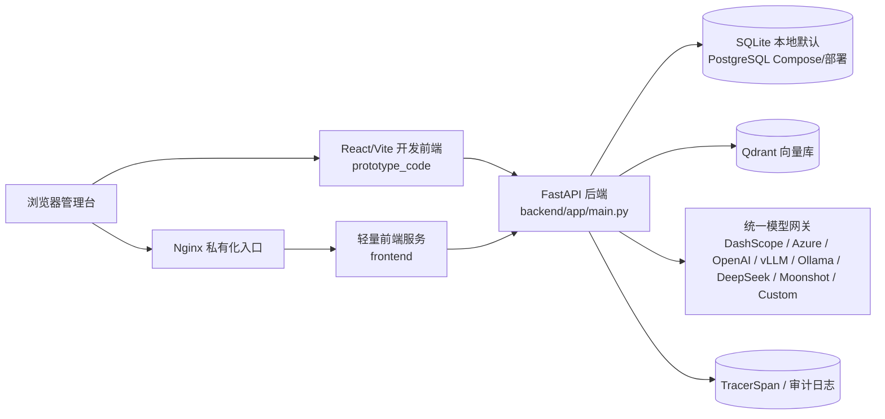

# AI物料中台

AI物料中台是一套面向企业物料标准化、物料库治理、申请审批和 AI 辅助治理的中台系统。当前项目包含后端 API、前端管理台、Docker 私有化部署配置、Qdrant 向量检索服务接入，以及围绕 sprint 交付沉淀下来的自动化测试。

## 核心能力

- 标准管理：类目库、层级类目、品名、属性、品牌等基础标准数据维护。
- 物料管理：物料库、物料档案、物料编码规则、批量重编码、编码映射和回滚。
- 申请流程：新增类目、新增物料编码、停采、停用等审批流程。
- 权限与审计：用户、角色、功能权限、API 权限、操作审计日志和审计导出。
- AI 能力：类目识别、物料新增预览、物料匹配、属性推荐、物料治理、模型网关、能力到模型映射、AI trace 调试。
- 导入导出：类目 CSV/XLSX/XLS 导入、模板下载、审计日志 XLSX 导出等。

## 当前架构


```mermaid
flowchart LR
    Browser["浏览器管理台"] --> Vite["React/Vite 开发前端<br/>prototype_code"]
    Browser --> Nginx["Nginx 私有化入口"]
    Nginx --> StaticUI["轻量前端服务<br/>frontend"]
    Vite --> API["FastAPI 后端<br/>backend/app/main.py"]
    StaticUI --> API
    API --> DB[("SQLite 本地默认<br/>PostgreSQL Compose/部署")]
    API --> Qdrant[("Qdrant 向量库")]
    API --> LLM["统一模型网关<br/>DashScope / Azure / OpenAI / vLLM / Ollama / DeepSeek / Moonshot / Custom"]
    API --> Trace[("TracerSpan / 审计日志")]
```

### 分层说明

| 层 | 目录/文件 | 说明 |
| --- | --- | --- |
| 主前端 | `prototype_code/` | React 18 + TypeScript + Vite 管理台，包含当前主要的业务页面和 E2E 验证入口。 |
| 部署前端 | `frontend/` | Node 静态服务 + 原生 JS 页面，用于当前 `docker-compose.yml` 中的私有化前端容器。 |
| 后端 API | `backend/app/` | FastAPI 单体 API，集中承载业务接口、权限、导入解析、AI 网关、Qdrant 同步和审计。 |
| 数据模型 | `backend/app/models.py` | SQLAlchemy 2.0 ORM 模型，覆盖标准、物料、流程、权限、AI 配置、审计和规则引擎。 |
| 部署编排 | `docker-compose.yml`、`nginx.conf` | PostgreSQL、Qdrant、后端、前端、Nginx 的本地私有化编排。 |
| 测试 | `tests/`、`prototype_code/tests/` | 后端 API 测试、Playwright 浏览器冒烟测试和前端专项测试。 |
| 需求与架构资料 | `prd/`、`planner-spec.json` | 产品需求、技术架构设计和 sprint 规划资料。 |

## 业务模块

### 标准域

- 类目库：管理类目体系的顶层容器，支持启用 Qdrant 语义检索。
- 类目：支持父子层级、类目属性、批量导入和 AI 类目识别。
- 品名：维护标准品名、单位、分类和 `PM` 序列编码。
- 属性：按品名维护属性定义，记录属性变更版本。
- 品牌：维护品牌编码、名称、描述和 logo。

### 物料域

- 物料库：管理物料集合、管理员角色、关联类目库、自动编码开关和重编码开关。
- 物料档案：维护物料编码、名称、品名、类目、品牌、状态、属性和生命周期信息。
- 编码规则：按物料库维护规则版本，支持固定文本、类目路径、属性、日期、流水号等片段。
- 批量重编码：生成预览、检测冲突、执行重编码、保留映射并支持回滚。

### 流程域

- 新增类目申请。
- 新增物料编码申请。
- 停采申请。
- 停用申请。
- 简单审批和多节点审批模式配置。

### 系统治理

- 用户管理、本地用户密码重置、HCM/本地账号归属。
- 角色管理、角色用户绑定、角色启停。
- 功能权限和 API 权限目录。
- 系统名称、图标、停采/停用原因选项。
- 写操作审计、审计检索、审计详情和导出。

### AI 基础设施

- 模型管理：统一 `Model` 表维护模型名称、供应商、base URL、API Key、能力标签和启停状态。
- 能力映射：`CapabilityMapping` 将业务能力映射到主模型和 fallback 模型。
- 模型解析：后端通过 `model_for_capability()` 为 `material_add`、`material_match`、`category_match`、`category_recognition`、`attr_recommend`、`material_governance` 等能力解析模型。
- 网关调用：以 OpenAI 兼容格式调用外部或本地模型服务。
- 密钥保护：使用 AES-GCM 加密模型密钥。
- 向量检索：Qdrant 按类目库维护 collection，用于类目语义同步和检索健康检查。
- Trace 调试：`TracerSpan` 记录 AI 调用链路，前端 `/debug/trace` 展示 trace 树。

## 技术栈

### 后端

- Python 3.11+ / 3.12
- FastAPI 0.128
- Pydantic v2
- SQLAlchemy 2.0
- Uvicorn
- httpx
- cryptography AES-GCM
- openpyxl 与内置 XML/BIFF 解析逻辑用于表格导入

### 前端

- React 18
- TypeScript 5
- Vite 6
- React Router 7
- TanStack Query 5
- Zustand 5
- Tailwind CSS 4
- Radix UI / shadcn 风格组件
- lucide-react 图标
- Recharts
- Playwright

### 数据与检索

- 本地默认：SQLite，数据库文件位于 `backend/app/material_retrieval.db`。
- 私有化/Compose：PostgreSQL 15。
- 向量库：Qdrant 1.12.6。

### 部署

- Docker / Docker Compose
- Nginx 反向代理
- 后端镜像：`python:3.12-slim`
- 前端镜像：`node:22-alpine`

## 本地启动

安装依赖并启动本地开发环境：

```bash
bash init.sh
```

启动后常用入口：

- React/Vite 前端：`http://localhost:5173`
- 后端 API 文档：`http://localhost:8000/docs`
- 后端健康检查：`http://localhost:8000/health`
- Qdrant：`http://localhost:6333`

如果需要单独启动主前端：

```bash
cd prototype_code
npm run dev -- --port 5173
```

停止本地服务：

```bash
kill "$(cat logs/backend.pid)" "$(cat logs/frontend.pid)" 2>/dev/null || true
docker-compose -p ai-material-platform down
```

## Docker Compose 私有化运行

```bash
docker compose up -d --build
```

服务端口：

- Nginx 统一入口：`http://localhost`
- 后端：`http://localhost:8000`
- 前端容器：`http://localhost:5173`
- PostgreSQL：`localhost:5432`
- Qdrant：`localhost:6333`

清理容器与数据卷：

```bash
docker compose down -v
```

## 常用验证

后端 API 测试：

```bash
cd backend
source .venv/bin/activate
cd ..
pytest -q
```

浏览器冒烟测试：

```bash
npx playwright test
```

主前端构建：

```bash
cd prototype_code
npm run build
```

## 关键环境变量

| 变量 | 说明 |
| --- | --- |
| `DATABASE_URL` | SQLAlchemy 数据库连接；未设置时默认使用本地 SQLite。 |
| `QDRANT_URL` | Qdrant 地址；Compose 中为 `http://qdrant:6333`。 |
| `LLM_GATEWAY_AES_KEY` | 模型密钥加密使用的 AES key 种子。 |
| `AI_DEBUG` | 设置为 `true` 时允许访问 AI trace 调试能力。 |
| `E2E_BASE_URL` | Playwright 前端地址，默认 `http://localhost:5173`。 |
| `E2E_API_URL` | Playwright 后端地址，默认 `http://localhost:8000`。 |

## 项目状态说明

当前代码以 `prototype_code/` 中的 React/Vite 管理台和 `backend/app/` 中的 FastAPI API 为主要业务实现。`frontend/` 是 Compose 部署链路使用的轻量前端入口；如果要继续建设完整产品体验，优先在 `prototype_code/` 中迭代。
