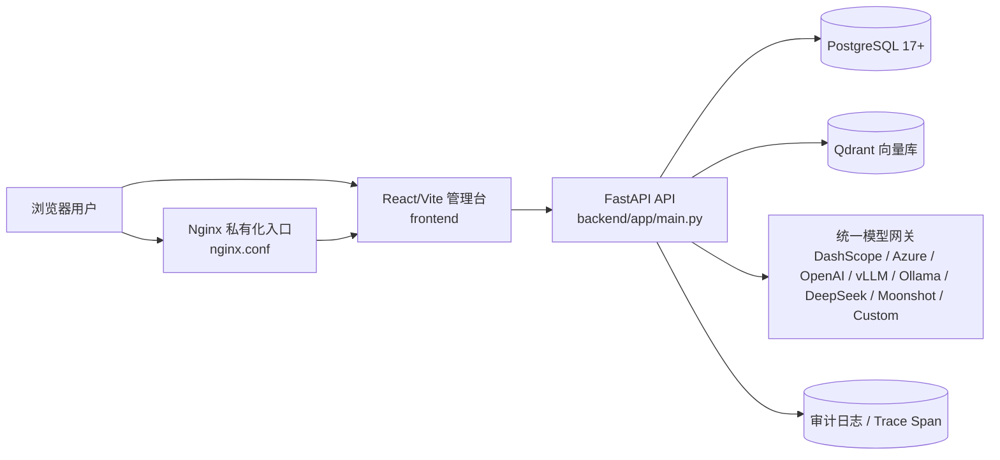

# AI物料中台

AI物料中台是一套面向企业物料标准化、物料库治理、申请审批和 AI 辅助治理的中台系统。当前 `main` 已合并后端 API、React 管理台、私有化部署入口、Qdrant 向量检索接入、统一模型网关、能力映射、物料编码规则、批量重编码和类目 CSV/XLSX/XLS 导入能力。

## 核心能力

- 标准管理：类目库、层级类目、类目属性、品名、属性、品牌维护。
- 物料管理：物料库、物料档案、生命周期状态、物料库权限隔离。
- 编码治理：物料库级编码规则版本、自动编码、重编码预览、执行、映射查询和回滚。
- 申请流程：新增类目、新增物料编码、停采、停用、审批模式配置。
- 系统治理：用户、角色、功能/API 权限、原因选项、系统信息、操作审计和导出。
- AI 能力：类目识别、物料新增预览、物料匹配、物料治理、属性治理、属性推荐。
- AI 基础设施：统一模型管理、能力到模型映射、fallback 模型、OpenAI 兼容调用、AI trace。
- 导入导出：类目模板下载、CSV/XLSX/XLS 导入、审计日志 XLSX 导出、编码映射导出。

## 当前架构


```mermaid
flowchart LR
    User["浏览器用户"] --> ReactUI["React/Vite 管理台<br/>frontend"]
    User --> Nginx["Nginx 私有化入口<br/>nginx.conf"]
    Nginx --> ReactUI
    ReactUI --> API["FastAPI API<br/>backend/app/main.py"]
    API --> DB[("PostgreSQL 17+")]
    API --> Qdrant[("Qdrant 向量库")]
    API --> LLM["统一模型网关<br/>DashScope / Azure / OpenAI / vLLM / Ollama / DeepSeek / Moonshot / Custom"]
    API --> Audit[("审计日志 / Trace Span")]
```

## 代码结构

| 路径 | 说明 |
| --- | --- |
| `backend/app/main.py` | FastAPI 应用入口，集中实现业务 API、权限检查、审计、AI 网关、Qdrant 同步和导入解析。 |
| `backend/app/models.py` | SQLAlchemy 2.0 数据模型，覆盖标准域、物料域、流程域、权限域、AI 配置、审计和规则引擎。 |
| `backend/app/schemas.py` | Pydantic v2 请求/响应模型。 |
| `backend/app/migrations/` | 数据迁移与 AI 配置迁移脚本。 |
| `frontend/` | 唯一业务管理台，React 18 + TypeScript + Vite，同时用于本地开发和 Docker Compose 私有化部署。 |
| `tests/` | 后端 API 测试与根级 Playwright 冒烟测试。 |
| `frontend/tests/` | 前端专项 Playwright 测试。 |
| `docker-compose.yml` | Qdrant、后端、前端、Nginx 私有化编排；PostgreSQL 由 `aios-infra` 提供。 |
| `nginx.conf` | 统一 HTTP 入口，代理 `/api`、`/docs`、`/health` 和前端路由。 |
| `prd/` | PRD、TDD 和架构图资料。 |

## 业务模块

### 标准域

- 类目库：顶层类目容器，支持启用 Qdrant 语义检索和重建向量索引。
- 类目：支持多层级结构、父子节点、类目属性、筛选、树形展示、批量导入和 AI 识别。
- 品名：维护标准品名、单位、分类、`PM` 顺序编码和启停状态。
- 属性：按品名维护属性定义、类型、单位、选项、必填规则和变更记录。
- 品牌：维护品牌编码、名称、描述、启停状态和 logo。

### 物料域

- 物料库：维护物料库编码、管理员角色、关联类目库、自动编码开关和重编码开关。
- 物料档案：维护物料编码、品名、类目、品牌、单位、状态、属性和生命周期历史。
- 生命周期：支持 `normal -> stop_purchase -> stop_use` 的受控状态流转。
- 权限隔离：物料库管理员与角色权限共同控制可见和可操作范围。

### 编码规则与重编码

- 规则版本：每个物料库可维护多版本编码规则，编辑生成新版本，不覆盖历史。
- 编码片段：支持固定文本、类目路径、属性、日期、流水号等片段组合。
- 重编码预览：支持全部物料或选中物料生成变更预览并检测冲突。
- 执行与回滚：执行后保留批次、明细和编码映射，可按批次回滚。
- 映射导出：支持编码映射查询和 CSV/XLSX 导出。

### 流程域

- 新增物料类目申请。
- 新增物料编码申请。
- 停采申请。
- 停用申请。
- 我的申请、待办任务、审批通过/驳回、流程历史。
- 简单审批和多节点审批模式配置。

### 系统治理

- 用户管理：HCM/本地账号归属、本地用户新增编辑、密码重置和删除。
- 角色管理：角色顺序编码、启停、角色用户绑定。
- 权限配置：目录、按钮、API 权限目录与角色授权。
- 系统配置：系统名称、图标、停采/停用原因选项。
- 审计日志：写操作自动记录，支持查询、详情和导出。

### AI 基础设施

- 模型管理：统一 `Model` 表维护供应商、模型名、base URL、API Key、能力标签和启停状态。
- 支持供应商：DashScope、Azure、OpenAI、vLLM、Ollama、DeepSeek、Moonshot、Custom。
- 能力映射：`CapabilityMapping` 将业务能力映射到主模型和 fallback 模型。
- 模型解析：`model_for_capability()` 为 AI 能力选择可用模型。
- 网关调用：后端以 OpenAI 兼容格式调用模型，并在超时/失败时尝试 fallback。
- 密钥保护：API Key 使用 AES-GCM 加密保存。
- Trace：`TracerSpan` 记录 trace id、span 类型、状态和耗时，前端 `/debug/trace` 可查看。

## 技术栈

### 后端

- Python 3.11+ / 3.12
- FastAPI 0.128，当前 API 版本 `15.0.0`
- Pydantic 2.9
- SQLAlchemy 2.0
- Uvicorn
- httpx
- cryptography AES-GCM
- openpyxl，以及内置 XML/BIFF 解析逻辑用于 XLSX/XLS 类目导入

### 前端

- React 18
- TypeScript 5
- Vite 6
- React Router 7
- TanStack Query 5
- Zustand 5
- Tailwind CSS 4
- Radix UI / shadcn 风格组件
- lucide-react
- Recharts
- Playwright

### 数据与部署

- 关系型数据库：由 `aios-infra` 管理的 PostgreSQL 17+。
- 向量检索：Qdrant 1.12.6。
- 容器编排：Docker Compose。
- 统一入口：Nginx。
- 后端镜像：`python:3.12-slim`。
- 前端镜像：`node:22-alpine` 构建，`nginx:1.27-alpine` 运行。

## 本地启动

推荐使用统一启动脚本：

```bash
bash init.sh
```

脚本会检查 Python、Node、Git 和 `aios-infra` PostgreSQL 连接，按需启动 Qdrant，安装依赖，初始化数据库表，并启动：

- 后端 API：`http://localhost:24435`
- API 文档：`http://localhost:24435/docs`
- React/Vite 管理台：`http://localhost:24434`

PostgreSQL 是必需依赖，并且只使用 `DATABASE_URL` 指向的 `aios-infra` 实例。脚本不会启动、停止或创建 PostgreSQL；连接不可用时会直接失败并提示从 `aios-infra` 处理。Docker 只用于本项目的 Qdrant 等容器。

单独启动主前端：

```bash
cd frontend
npm run dev -- --port 24434
```

停止本地进程：

```bash
kill "$(cat logs/backend.pid)" "$(cat logs/frontend.pid)" 2>/dev/null || true
docker-compose -p ai-material-platform down
```

## Docker Compose 私有化运行

```bash
docker compose up -d --build
```

Compose 服务：

- `qdrant`：`localhost:6333` / `localhost:6334`
- `backend`：`http://localhost:24435`
- `frontend`：`http://localhost:24434`
- `nginx`：`http://localhost`

启动 Compose 前必须提供可从后端容器访问的 `DATABASE_URL`，并指向 `aios-infra` PostgreSQL。在 macOS 上如果通过宿主机映射端口连接，主机名通常应使用 `host.docker.internal`，不能使用容器自身的 `127.0.0.1`。

Nginx 路由：

- 前端页面：`http://localhost/materials`
- API：`http://localhost/api/v1/...`
- API 文档：`http://localhost/docs`
- 健康检查：`http://localhost/health`

清空容器和数据卷：

```bash
docker compose down -v
```

## 验证

后端冒烟：

```bash
curl -fsS http://localhost:24435/docs >/dev/null
```

主前端构建：

```bash
cd frontend
npm run build
```

浏览器 E2E：

```bash
npx playwright test
```

后端 API 测试：

```bash
pytest -q
```

## 关键环境变量

| 变量 | 说明 |
| --- | --- |
| `DATABASE_URL` | 必填；必须指向由 `aios-infra` 管理的 PostgreSQL，本项目不会创建数据库服务。 |
| `QDRANT_URL` | Qdrant 地址；Compose 中为 `http://qdrant:6333`。 |
| `LLM_GATEWAY_AES_KEY` | 模型 API Key 加密使用的 AES key 种子。 |
| `AI_DEBUG` | 设置为 `true` 时允许访问 AI trace 调试能力。 |
| `BACKEND_PORT` | `init.sh` 启动后端的端口，默认 `24435`。 |
| `FRONTEND_PORT` | `init.sh` 启动前端的端口，默认 `24434`。 |
| `E2E_BASE_URL` | Playwright 前端地址，默认 `http://localhost:24434`。 |
| `E2E_API_URL` | Playwright 后端地址，默认 `http://localhost:24435`。 |

## 当前说明

当前主要业务实现位于 `backend/app/` 和 `frontend/`。前端仅保留这一套 React/Vite 管理台，本地开发与 Docker Compose 部署共用同一份源码。
