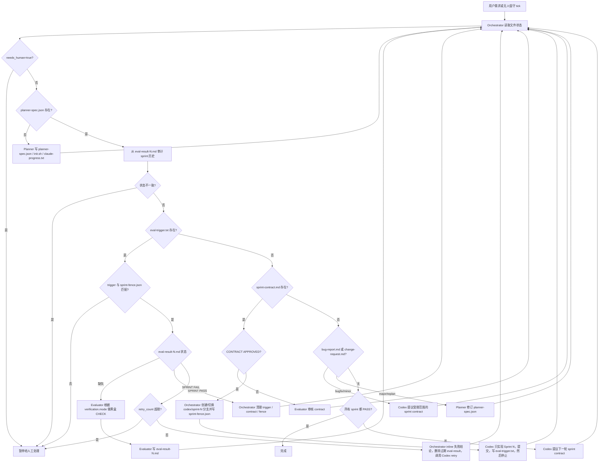

**中文** | [English](./README.md)

# SprintFoundry

SprintFoundry 是一个面向产品迭代的多代理协作框架：Claude 负责规划、路由和独立验收，Codex 负责真实代码实现。仓库当前主要包含流程规范、角色定义和运行约束，本身不是业务应用代码仓库。

## 当前项目架构

### 核心角色

项目采用 4 个角色协作：

| 角色 | 运行位置 | 职责 |
| --- | --- | --- |
| Planner | Claude Code | 把用户的短需求扩展为完整产品规格、视觉语言和 sprint 计划 |
| Generator | Codex CLI | 读取规格和已批准的 sprint contract，完成一轮实现、自检和提交 |
| Evaluator | Claude Code + 验证工具 | 审核 sprint contract，并做独立黑盒 CHECK：浏览器、API、CLI、任务队列或库消费者 |
| Orchestrator | Claude Code | 读取文件状态并决定下一步该调用 Planner、Generator 还是 Evaluator |

### 运行边界

当前架构有一个明确边界：

- Claude 不负责写业务代码
- Codex 不负责评估自己的产出
- 进度推进依赖文件产物，而不是聊天上下文

### 状态驱动架构

这个 harness 的核心不是“对话记忆”，而是“文件状态机”：

- `planner-spec.json`
  Planner 产出的产品规格、视觉语言、技术栈、验证模式和 sprint 列表
- `change-request.md`
  已有产品上的版本迭代请求，先分类再决定是进入小迭代 sprint 还是先 replan
- `bug-report.md`
  专门用于回归和 defect 的输入文件，进入独立 bugfix sprint
- `sprint-contract.md`
  当前 sprint 的可验收合同，必须先经 Evaluator 批准
- `sprint-fence.json`
  当前 sprint 的边界档案（预期 sprint 号 + contract 批准时的 git HEAD），由 Orchestrator 在调用 Codex 之前写入。用来防止跨 sprint 漂移：一旦 `eval-trigger.txt` 里的 sprint 号与 fence 不一致，Orchestrator 直接暂停。
- `eval-result-{N}.md`
  第 N 个 sprint 的验收结果，只有 Evaluator 可以写
- `eval-trigger.txt`
  Generator 提交后写入的检查信号文件
- `run-state.json`
  无人值守模式下的运行状态、重试次数和人工介入标记
- `run-events.ndjson`
  结构化运行事件流，适合做审计和监控
- `orchestrator-log.ndjson`
  Orchestrator 路由决策审计日志
- `human-escalation.md`
  自动暂停后留给人工接管的当前摘要
- `claude-progress.txt`
  跨会话进度日志与交接记录
- `harness-audit.ndjson`
  仅追加的取证时间线。记录每一次 Orchestrator 运行、审计发现、状态迁移、commit、hook 拦截/绕过，永不重写。
- `init.sh`
  启动完整开发环境的统一入口

## 强制入口

如果希望这套流程被真正执行，而不是只靠提示词约定，请把下面这个入口当成唯一入口：

```bash
./orchestrate.sh --project-dir /absolute/path/to/project --user-prompt "一句产品需求"
```

或直接运行：

```bash
python3 scripts/orchestrate.py --project-dir /absolute/path/to/project --user-prompt "一句产品需求"
```

它会先读取磁盘状态，再决定下一步：

- 没有 `planner-spec.json` -> 只能进入 Planner
- 有 `bug-report.md` -> 先进入 bugfix sprint contract
- 有 `change-request.md` 且 `Type: minor_feature` -> 先进入 iteration sprint contract
- 有 `change-request.md` 且 `Type: major_feature` / `replan` -> 先让 Planner revise spec
- 有 `sprint-contract.md` 但没有 `CONTRACT APPROVED` -> 只能进入 Evaluator 做 contract review
- 有 `eval-trigger.txt` -> 只能进入 Evaluator 做 CHECK
- 只有 contract 已批准时，才会给出或执行 Generator 的实现命令

这一步的目的就是防止“主 Agent 直接开始实现代码”。

### 上下文清洁设计

这套架构专门考虑了长时间运行时的上下文污染问题。目标不是让模型“记住一切”，而是让模型每一轮都尽量只面对当前有效事实。

设计原则：

- 状态写进文件，不依赖长对话记忆
- 每个 sprint 都是一个独立、可重读的工作单元
- Generator 和 Evaluator 分离，减少“自己骗自己”
- 通过 `claude-progress.txt` 做压缩式交接，而不是无限追加历史

这意味着随着项目变长，系统依赖的是“可重建上下文”，不是“累积上下文”。

### Sprint 分支设计

当前推荐采用“每个 sprint 一条 Git 分支”的工作方式，而不是所有实现都直接堆在 `main` 上。

这样做的好处：

- 每个 sprint 的实现和重试历史彼此隔离
- Evaluator 失败后更容易回溯和修复
- `main` 只承载已经通过验收的进度
- 无人值守模式可以明确记录当前活跃分支并从该分支恢复

### 单调通过不变量与审计日志

Sprint N 是否完成的**唯一权威信号**是：`eval-result-{N}.md` 存在且包含字面量字符串 `SPRINT PASS`。其他所有文件（`run-state.json`、`claude-progress.txt`、sprint 分支、commit 日志）都只是派生状态，不能作为完成判断的依据。

这一不变量由两层机制共同保证：

1. **检测层 — Orchestrator 审计。** `scripts/orchestrate.py` 在每条路由规则触发**之前**都会运行 `audit_sprint_history`。一旦声明状态与 `eval-result-{N}.md` 文件冲突（例如 Sprint N 被标记为已推进、但在它之前还有 sprint 缺少 `SPRINT PASS`），Orchestrator 立即把 `needs_human` 置为 `true` 并暂停，阻止任何其他规则继续执行。
2. **预防层 — Git hooks。** `.githooks/pre-commit` 会拒绝那些"在还有早期 sprint 未通过的情况下，推进 sprint 计数"的 commit。`.githooks/post-commit` 会把每一次 commit（sha、作者、subject、受影响的敏感路径）写入 `harness-audit.ndjson`。在每个克隆里执行一次以下命令即可启用：

   ```bash
   bash scripts/install-hooks.sh
   ```

   只有 `HARNESS_BYPASS=1 git commit ...` 可以绕过 pre-commit 检查，而且每一次绕过本身都会被记录为一条 `commit_bypassed` 事件，确保任何紧急覆盖都不会静默发生。

`harness-audit.ndjson` 是一个单一的仅追加 NDJSON 文件，由 Orchestrator、git hooks 和人工（通过 `scripts/harness-log.py note`）共同写入。事件类型包括 `orchestrator_run`、`audit_finding`、`state_transition`、`eval_result_observed`、`commit_recorded`、`commit_blocked`、`commit_bypassed`、`note`。**永远不要重写这个文件** — 需要轮转时，把它拷走一份，让下一次追加时自动创建新文件即可。

常用审计命令：

```bash
python3 scripts/harness-log.py tail -n 30
python3 scripts/harness-log.py filter --event audit_finding
python3 scripts/harness-log.py filter --sprint 3 --json
python3 scripts/harness-log.py verify                # 用 eval-result 重新校对声明状态
python3 scripts/harness-log.py note --text "reason"  # 给人工操作留下批注
```

### 主文档分层

仓库目前分成热路径提示词和冷存储参考文档：

1. [AGENTS.md](./AGENTS.md)
   Codex 直接读取的精简操作契约，应保持短小。
2. [CLAUDE.md](./CLAUDE.md)
   Claude Code 侧的精简路由手册。
3. [.claude/agents/planner.md](./.claude/agents/planner.md)
   [.claude/agents/generator.md](./.claude/agents/generator.md)
   [.claude/agents/evaluator.md](./.claude/agents/evaluator.md)
   [.claude/agents/orchestrator.md](./.claude/agents/orchestrator.md)
   Claude Code 自动加载的角色级提示词。
4. [docs/protocol.md](./docs/protocol.md)
   完整历史协议参考，按需阅读，不作为热路径 prompt。

### 当前实现状态

- 这是一个“流程/协议仓库”，目前只有文档，没有业务代码目录。
- 当前唯一工作流是以 `planner-spec.json` 为中心的 sprint 循环。
- 现在支持三类入口：新产品规划、bugfix sprint、版本迭代 sprint。
- `AGENTS.md`、`CLAUDE.md` 和 `.claude/agents/*.md` 现在刻意保持精简。
- `docs/protocol.md` 保留较长的协议背景和历史理由，供需要时查阅。

## 工作流

完整流程如下：



关键门禁：

- 没有 `CONTRACT APPROVED`，Generator 不能开始编码。
- `sprint-fence.json` 与 `eval-trigger.txt` 不一致时，Orchestrator 拒绝路由到 Evaluator，直接暂停。

关键状态规则：

- 没有 `planner-spec.json`，先规划
- 有 `bug-report.md`，先走 bugfix contract
- 有 `change-request.md`，先按 `Type` 做 bugfix / iteration / replan 分流
- 有 `sprint-contract.md` 但未批准，先做 contract review
- 有 `eval-trigger.txt`，先做独立 CHECK
- 只有 `eval-result-{N}.md` 出现 `SPRINT PASS`，该 sprint 才完成
- SPRINT PASS 之后，Orchestrator 会删除 `sprint-contract.md` 和 `sprint-fence.json`，下一 sprint 必须重新走一轮 contract 协商

## 验证模式

Evaluator 是黑盒验收器，不再是浏览器专用验收器。Planner 应该在 `planner-spec.json` 中写入 `verification` 块，让 sprint contract 通过正确的外部表面被验证：

```json
{
  "verification": {
    "mode": "browser | api | cli | job | library",
    "base_url": "http://localhost:3000",
    "command": "pytest -q"
  }
}
```

支持的模式：

| 模式 | Evaluator 验证表面 | 典型证据 |
| --- | --- | --- |
| `browser` | Playwright MCP | 截图、可见 UI 状态、用户流程 |
| `api` | `curl`、`httpx`、OpenAPI/Newman 风格检查 | HTTP 状态码、JSON 响应、API 可见的持久化状态 |
| `cli` | Shell 命令 | exit code、stdout/stderr、生成文件 |
| `job` | 队列/任务端点或脚本 | 入队任务、轮询状态、副作用 |
| `library` | 外部 consumer 项目或示例脚本 | 安装/导入成功、公开 API 输出 |

Sprint contract 应该写成**可黑盒验证**的成功条件。后端 API 条件和浏览器条件一样有效：

```markdown
- [ ] 客户端可以创建用户，并按 id 再次读取该用户。
  Evaluator steps:
  1. Run `bash init.sh`
  2. POST `http://localhost:8000/users` with JSON `{ "email": "a@example.com" }`
  3. Assert status is 201 and the response body contains an `id`
  4. GET `http://localhost:8000/users/<id>`
  5. Assert status is 200 and `email` equals `a@example.com`
```

## 上下文清洁规则

为了减少 AI 垃圾代码、补丁式演化和上下文膨胀，当前架构默认遵守以下规则：

### 1. 文件优先于聊天

- 任何阶段开始前，都优先读取当前文件产物
- 如果文件内容和聊天上下文冲突，以文件为准
- Orchestrator 不根据“记得之前聊过什么”做路由，而是根据磁盘状态做路由

### 2. `claude-progress.txt` 只保留摘要

`claude-progress.txt` 不是会话 transcript，而是滚动 handoff：

- 保留最新项目摘要
- 保留最近 3 个 sprint 条目
- 每个 sprint 条目控制在 3 到 5 行
- 只写状态、关键变更、阻塞点和 evaluator 反馈

旧内容应该被压缩，而不是一直追加。

### 3. 每轮只读最小必要上下文

Generator 在进入实现前，应该只重读：

- `planner-spec.json`
- `sprint-contract.md`
- 当前 sprint 对应的最新 `eval-result-{N}.md`，仅在 retry 时

不要把完整历史聊天当作当前实现依据。

### 4. 提交前做一次清洁检查

每个 sprint 在提交前都应该主动检查：

- 是否留下了调试代码或临时日志
- 是否因为多轮修补产生了重复逻辑
- 是否出现了“包一层再包一层”的低质量抽象
- 当前 diff 是否仍然聚焦于已批准的 sprint，而不是偷偷扩 scope

### 5. 失败修复必须最小化

当 sprint 失败时：

- 只修 Evaluator 指出的问题
- 不借机混入无关重构
- 如果问题已经上升成架构漂移，就应该回到规划层，而不是继续补丁

## 无人值守模式

如果你希望这套 harness 长时间自动推进，推荐启用“有限重试、可暂停”的无人值守模式，而不是无限循环。

### 设计目标

- 可以定时或守护式运行
- 每轮都能从文件状态恢复
- 连续失败时自动暂停
- 给人工留出明确的接管入口

### 关键状态文件

无人值守模式建议维护 `run-state.json`。仓库中提供了模板：

- [run-state.example.json](./run-state.example.json)

推荐字段包括：

- `mode`
- `current_sprint`
- `retry_count`
- `last_successful_sprint`
- `last_failure_reason`
- `needs_human`
- `active_branch`
- `base_branch`
- `last_run_at`

### 推荐运行模式

典型无人值守循环如下：

```text
定时器 / 守护进程
  -> 读取 run-state.json
  -> 运行 Orchestrator
  -> 按文件状态调用 Planner / Codex / Evaluator
  -> 更新 run-state.json 和 claude-progress.txt
  -> 判断 complete / paused / next loop
```

### 必须暂停的情况

为避免无限自循环，建议在这些情况下自动暂停并等待人工：

- 同一 sprint 连续失败超过 2 次
- `init.sh` 无法恢复开发环境
- Evaluator 判断问题已经上升为架构漂移
- 需要修改 sprint contract 才能继续推进
- 必要的密钥、服务或依赖缺失

暂停时至少要做两件事：

- 在 `run-state.json` 中写明 `mode = paused` 和 `needs_human = true`
- 在 `claude-progress.txt` 中写入简短阻塞说明

## 仓库结构

```text
.
├── AGENTS.md
├── CLAUDE.md
├── README.md
├── README.zh-CN.md
├── orchestrate.sh
├── scripts/
│   ├── orchestrate.py
│   ├── harness-log.py
│   └── install-hooks.sh
├── .githooks/
│   ├── pre-commit
│   └── post-commit
├── tests/
│   └── test_orchestrate.py
├── .claude/
│   ├── agents/
│   │   ├── evaluator.md
│   │   ├── generator.md
│   │   ├── orchestrator.md
│   │   └── planner.md
│   └── skills/
│       ├── harness-branching/
│       │   └── SKILL.md
│       └── harness-observability/
│           ├── SKILL.md
│           └── references/
├── harness-audit.ndjson
├── run-state.example.json
├── run-events.example.ndjson
├── orchestrator-log.example.ndjson
├── human-escalation.example.md
├── change-request.example.md
└── bug-report.example.md
```

角色提示词和本地 skill 都放在 `.claude/` 下，按 Claude Code 约定自动被识别为 subagent 定义和项目级 skill。

## 本地 Skill

仓库当前包含两个面向运行治理的本地 skill：

- [.claude/skills/harness-observability/SKILL.md](./.claude/skills/harness-observability/SKILL.md)
- [.claude/skills/harness-branching/SKILL.md](./.claude/skills/harness-branching/SKILL.md)

它们负责把以下能力封装成可复用工作流：

- 无人值守运行状态维护
- 结构化事件日志
- Orchestrator 路由审计
- 人工接管摘要
- `claude-progress.txt` 压缩与上下文清洁
- 每个 sprint 的分支创建、切换和合并前约束

仓库里同时提供了最小模板：

- [run-state.example.json](./run-state.example.json)
- [run-events.example.ndjson](./run-events.example.ndjson)
- [orchestrator-log.example.ndjson](./orchestrator-log.example.ndjson)
- [human-escalation.example.md](./human-escalation.example.md)

## 使用方式

### 1. 环境准备

最低要求：

- Claude Code
- Codex CLI
- Node.js / npm
- Python 和 `pytest`
- Playwright MCP
- 一个真实可启动的项目目录

`CLAUDE.md` 中给出的 Codex 最低准备方式：

```bash
npm install -g @openai/codex
codex --version
```

如果 Codex 在本地环境里已经完成认证，则不需要额外设置 `OPENAI_API_KEY`。
只有在纯 CLI 且尚未登录的环境里，才需要再提供 `OPENAI_API_KEY`。

如果需要 Playwright MCP，可按 `CLAUDE.md` 中的配置接入：

```json
{
  "mcpServers": {
    "playwright": {
      "command": "npx",
      "args": ["@playwright/mcp@0.0.29"]
    }
  }
}
```

推荐固定 Playwright MCP 版本，而不是使用 `@latest`，避免长周期项目在中途被上游更新打断。

### 2. 初始化一个真实项目

这个仓库本身没有 `planner-spec.json`、`init.sh`、测试或应用代码，因此要把它用于真实项目时，通常需要：

1. 在目标项目目录中放入本仓库的规范文件。
2. 初始化 Git 仓库。
3. 让 Planner 先生成：
   - `planner-spec.json`
   - `init.sh`
   - `claude-progress.txt`
4. 确保 `init.sh` 能真正启动前后端和依赖服务。

更实际的理解方式是：

- 这个仓库提供的是“协作协议”
- 真正的应用代码、测试、数据库和运行脚本应该存在于消费这套协议的业务项目中

### 3. Orchestrator 阶段

Orchestrator 是入口。它每次都先读文件状态，再决定走哪条路径：

- 没有 `planner-spec.json` -> 调 Planner
- 发现 `bug-report.md` -> 调 Codex 先生成 bugfix sprint contract
- 发现 `change-request.md` -> 先按 `Type` 路由到 bugfix / minor iteration / replan
- 发现待审核的 `sprint-contract.md` -> 调 Evaluator 做 contract review
- 发现 `eval-trigger.txt` -> 调 Evaluator 做 CHECK
- 其他情况 -> 调 Codex 进入下一轮 sprint

如果 `claude-progress.txt` 已经变成长日志，Orchestrator 应该先把它压缩回摘要形式，再继续路由。
如果启用了无人值守模式，Orchestrator 还需要同步读写 `run-state.json`，并在超出重试阈值时主动暂停。

仓库里现在附带了一个最小可执行版本：

- [scripts/orchestrate.py](./scripts/orchestrate.py)
- [orchestrate.sh](./orchestrate.sh)
- [change-request.example.md](./change-request.example.md)
- [bug-report.example.md](./bug-report.example.md)
- [tests/test_orchestrate.py](./tests/test_orchestrate.py)

它会：

- 读取 `planner-spec.json` / `change-request.md` / `bug-report.md` / `sprint-contract.md` / `eval-trigger.txt`
- 计算当前 sprint
- 更新 `run-state.json`
- 追加 `orchestrator-log.ndjson` 与 `run-events.ndjson`
- 在缺少 contract approval 时阻止直接进入实现阶段
- 在 bugfix 和 iteration 请求进入时，先生成对应 contract，而不是直接编码

### 4. Planner 阶段

当用户给出一个 1 到 4 句的产品需求后，由 Claude 中的 Planner 生成完整规格。

输出物：

- `planner-spec.json`
- `init.sh`
- `claude-progress.txt` 初始记录

### 5. Generator 阶段

由 Orchestrator 通过 Codex CLI 调用 Generator。Generator 不是 Claude subagent，而是外部 Codex 进程。

`scripts/orchestrate.py` 现在会按 Codex 版本自动选择命令：
- `>= 0.120.0` 使用 `codex exec --full-auto --skip-git-repo-check`
- 低版本自动回退到 `codex -a never exec --skip-git-repo-check`

典型调用：

```bash
codex exec --full-auto --skip-git-repo-check \
  "Read planner-spec.json. Propose sprint-contract.md for Sprint N. Follow AGENTS.md Generator rules."
```

合同批准后进入实现：

```bash
codex exec --full-auto --skip-git-repo-check \
  "sprint-contract.md is approved. Implement Sprint N. Commit and write eval-trigger.txt. Follow AGENTS.md."
```

Generator 每次会话的固定启动 ritual：

```bash
cat claude-progress.txt
git log --oneline -10
bash init.sh
```

然后必须先做一次 smoke test，再开始改代码。

在当前架构里，Generator 还应遵守一个额外原则：

- 优先删除坏代码，而不是继续在坏代码上叠加新层

### 6. Evaluator 阶段

Evaluator 有两种模式：

- Contract Review
  审查 `sprint-contract.md` 是否能通过配置的验证模式被黑盒验证
- CHECK
  读取 `eval-trigger.txt` 后启动环境，并通过合适的外部表面逐条执行验收步骤：`browser` 用 Playwright，`api` 用 HTTP 检查，`cli` 用命令行断言，`job` 用任务状态和副作用，`library` 用外部 consumer harness

验收结果写入：

- `eval-result-{N}.md`

只有出现 `SPRINT PASS`，当前 sprint 才算结束。

### 7. Sprint FAIL 修复

Evaluator 判定失败时，Orchestrator 会把评审结论 inline 进 retry prompt，并在调用 Codex **之前**删除 `eval-result-{N}.md`。这一步删除是有意为之：让下一轮 orchestrator 看到"没有 eval-result"→强制重新召回 Evaluator 做 CHECK，而不是在过期的 FAIL 结论上反复空转。Generator 只能修复 inline prompt 里列出的问题：

```bash
codex exec --full-auto --skip-git-repo-check \
  "Sprint N failed. Fix ONLY the cited issues from the inlined Evaluator verdict. \
   Re-commit and write eval-trigger.txt containing sprint=N. \
   STOP after writing eval-trigger.txt."
```

在 `Codex retry -> Evaluator re-CHECK` 的循环中，`retry_count` **保留不清零**。只有真实的进展（`SPRINT PASS`、进入新 sprint、重新进入 contract/planner 阶段）才会把它归零。一旦计数超过配置的重试上限，Orchestrator 会直接置 `needs_human=true` 并暂停，而不是继续空转。

## 常用命令

```bash
bash init.sh
python3 -m pytest tests/test_orchestrate.py -q
npx playwright test
cat claude-progress.txt
cat sprint-contract.md
cat eval-trigger.txt

# 每个克隆只需执行一次，安装 git 审计钩子
bash scripts/install-hooks.sh

# 审计日志查看
python3 scripts/harness-log.py tail -n 30
python3 scripts/harness-log.py verify
python3 scripts/harness-log.py filter --event audit_finding
python3 scripts/harness-log.py note --text "人工介入原因"
```

## 推荐落地约定

为了让这套 harness 真正稳定运行，建议在真实项目里补齐以下约定：

- 明确唯一的规范来源，以 `AGENTS.md` 为准
- 保证 `init.sh` 幂等，可重复执行
- 让 `pytest -q` 和浏览器 smoke test 都可在本地稳定通过
- 为每个 sprint 保持单次 clean commit
- 为每个 sprint 使用单独的 Git 分支，推荐命名 `codex/sprint-<N>-<slug>`
- 不让 Generator 和 Evaluator 修改彼此负责的产物
- 让 Orchestrator 始终基于文件状态做判断，而不是基于对话记忆猜测
- 定期压缩 `claude-progress.txt`，避免它重新变成长上下文容器
- 把“删除临时代码、删除假抽象、删除重复逻辑”当成每轮提交前的固定动作
- 为无人值守运行补一个定时器或守护脚本，并让它只依赖文件状态恢复
- 给每个 sprint 设定最大自动重试次数，超过阈值后必须人工介入

## 已知注意点

- 当前仓库是“协议仓库”**加上**一套最小可运行的执行层：`scripts/orchestrate.py`（Orchestrator）、`scripts/harness-log.py`（审计 CLI）、`.githooks/`（pre-/post-commit 钩子）、`harness-audit.ndjson`（仅追加取证日志）。尚未包含最小可运行示例项目，因此 `init.sh` 并不在这里提供，完整的 CHECK 链路也无法只靠本仓库端到端演示。
- 无人值守模式的状态模型、重试语义和 Monotonic-PASS 不变量都由 `scripts/orchestrate.py` 与 git hooks 共同强制执行，但尚未配套真正的守护脚本或定时任务。
- Git hooks 在新克隆的仓库里默认不生效。每个克隆需要执行一次 `bash scripts/install-hooks.sh`，让 `core.hooksPath` 指向 `.githooks/`。
- 角色提示词（`.claude/agents/*.md`）和运行 skill（`.claude/skills/*/SKILL.md`）依靠 Claude Code 对 `.claude/` 目录的约定自动加载；若要在 Claude Code 之外运行本 harness，需要自行改造这些入口。
- 如果你准备继续演进这个仓库，下一步最值得做的是补一套最小可运行示例项目，并让 `init.sh`、测试、验收链路和守护循环可以直接跑通。

## 参考文献

- [Anthropic Engineering: Harness Design for Long-Running Apps](https://www.anthropic.com/engineering/harness-design-long-running-apps)
